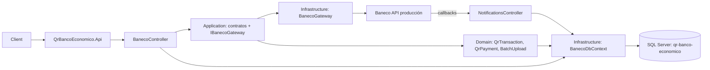

# Code Graph



## Dependencias

```text
Api -> Application -> Domain
Api -> Infrastructure -> Application, Domain
Infrastructure -> SQL Server / API Market Baneco
```

## Flujos

- QR: `POST /qrs` → Baneco → `QrTransactions`; el callback agrega `QrPayments`.
- Consulta: estado, pagados y movimientos son proxies de lectura hacia Baneco.
- Planilla: `POST /batches` → Baneco → `BatchUploads`.
- Seguridad: token y AES son configuración externa.
