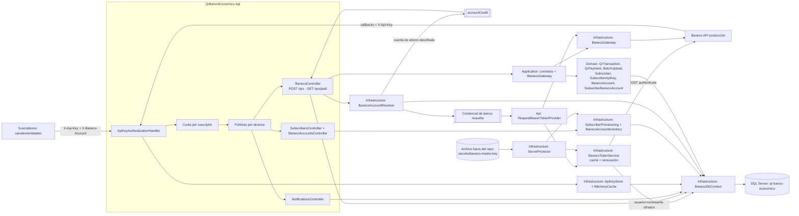

# Code Graph



## Superficie expuesta

Hacia los suscriptores, **dos métodos y nada más**:

| Método | Ruta | Alcance |
|---|---|---|
| POST | `/api/baneco/qrs` | `qr:write` |
| GET | `/api/baneco/qrs/paid/{fecha}` | `qr:read` |

El resto de la API de Baneco no se proxea. Se retiraron a propósito el cifrado y **descifrado** (obligaba a
aceptar la clave AES del banco por *query string*, donde queda en los logs de acceso), la autenticación
(el proxy gestiona el token por su cuenta), la anulación y el estado de QR, los movimientos de cuenta y
las planillas. Los callbacks `/api/notifications/*` son tráfico entrante del banco, no superficie de
suscriptor; la administración vive bajo `/api/admin/*` con alcance `admin`.

## La cuenta a acreditar nunca viaja en la solicitud

`accountCredit` es un atributo de la suscripción, no del pedido. El proxy lo rechaza si viene en el
cuerpo (`additionalProperties: false` → 400) y lo agrega él mismo desde la fila del suscriptor.

```text
suscriptor ──▶ { transactionId, currency, amount, dueDate, … }        sin accountCredit
                                  │
                                  ▼
        Subscribers.SavingsAccountEncrypted  ──Unprotect(llave maestra)──▶  criptograma de Baneco
                                  │
                                  ▼
proxy ─────▶ { transactionId, accountCredit, currency, amount, … }     con accountCredit
```

Si el cuerpo lo aceptara, conocer el criptograma de otro suscriptor bastaría para emitir QR que
acreditan una cuenta ajena. Al vivir en la fila del suscriptor, la cuenta acreditada queda determinada
por la API Key presentada y por nada más.

## Tres planos, no dos

Son independientes y no deben confundirse:

```text
Suscriptor ──X-Api-Key: {guid}──▶  Proxy  ──Authorization: Bearer <token de la cuenta>──▶  Baneco
           (quién nos consume)        │    (con qué credencial hablamos con el banco)
                                      └────  accountCredit  (a qué cuenta de ahorro acreditamos)
```

| Plano | Dónde vive | Qué decide |
|---|---|---|
| API Key | `SubscriberApiKeys.ApiKey` (GUID en claro) | quién nos consume |
| Credencial de Baneco | `BanecoAccounts` (usuario y contraseña cifrados) | con qué credencial hablamos con el banco |
| Cuenta de ahorro | `Subscribers.SavingsAccountEncrypted` (cifrada) | a qué cuenta entra el dinero |

Varias suscripciones pueden compartir una credencial de Baneco y aun así recaudar cada una en su
propia cuenta: por eso el segundo y el tercer plano están separados.

| | API Key del proxy | Credencial de Baneco |
|---|---|---|
| Cabecera | `X-Api-Key` | `Authorization: Bearer` |
| Identifica | al suscriptor ante el proxy | al proxy (o al suscriptor) ante el banco |
| Se guarda | GUID en claro en `SubscriberApiKeys` | usuario y contraseña cifrados en `BanecoAccounts`; el token, solo en memoria |
| La emite | este proxy | Baneco |

## Ciclo de vida del token de Baneco

El banco emite el token con ~30 minutos de vigencia. El proxy lo obtiene y lo renueva solo; ningún
operador pega tokens en archivos de configuración.

```text
solicitud ──▶ ¿token en caché y vigente? ── sí ──▶ se usa
                        │ no
                        ▼
        BanecoAccounts.AuthUserNameEncrypted / AuthPasswordEncrypted
                        │  SecretProtector.Unprotect (AES-256-GCM)
                        ▼
        POST api/authentication/authenticate ──▶ token
                        │  vencimiento: claim exp del JWT, o TokenLifetimeMinutes
                        ▼
        caché en memoria hasta (exp − TokenRenewMarginSeconds)

401 del banco ──▶ invalida, reautentica y reintenta la solicitud una sola vez
```

- Un `SemaphoreSlim` por cuenta evita que una ráfaga tras el vencimiento dispare N autenticaciones.
- La caché es **por proceso**. Con varias instancias cada una autentica por separado; si Baneco resultara
  ser de sesión única hay que moverla a Redis con lock distribuido. Pendiente de confirmar con el banco.
- Precedencia: token gestionado → token estático `Baneco:Accounts:{ref}` → `Bearer` del llamante →
  `Baneco:BearerToken`. Los tres últimos son respaldos heredados y no se renuevan solos.

## Cifrado en reposo (transitorio)

```text
BanecoAccounts.AuthUserNameEncrypted     ┐
BanecoAccounts.AuthPasswordEncrypted     ├─ "v1:" + base64( nonce(12) ‖ tag(16) ‖ ciphertext )
Subscribers.SavingsAccountEncrypted      │            │
QrTransactions.AccountCreditEncrypted    ┘            │
                                       AES-256-GCM ◀──┴─ llave de 256 bits en
                                                         secrets/baneco-master.key (.gitignore)
```

La cuenta de ahorro lleva **dos capas**: llega ya cifrada con la clave AES de Baneco y el proxy le
agrega la suya. Descifrar la capa del proxy devuelve el criptograma del banco, no el número de cuenta.

Cubre respaldos y lecturas directas de la base; **no** cubre a quien ya tiene el servidor de aplicación,
donde conviven llave y datos. Es un puente hasta habilitar Key Vault, HSM o Always Encrypted.

## Dependencias

```text
Api -> Application -> Domain
Api -> Infrastructure -> Application, Domain
Infrastructure -> SQL Server / API Market Baneco
```

## Flujos

- QR: `POST /qrs` → resuelve credencial y cuenta de ahorro → token vigente → Baneco → `QrTransactions`;
  el callback agrega `QrPayments`. Sin cuenta de ahorro cargada responde `409` sin llamar al banco.
- Pagados: `GET /qrs/paid/{fecha}` → Baneco → se filtra a los QR del suscriptor antes de responder.
- Seguridad de entrada: cada solicitud presenta `X-Api-Key`; se resuelve el suscriptor, se aplica su
  cuota y se exige el alcance del endpoint. `QrTransactions` queda atribuido al suscriptor y solo es
  visible para él.
- Seguridad de salida: se resuelve la cuenta del inventario y se usa su token gestionado. Si el
  suscriptor no tiene cuentas concedidas queda en modo pass-through y aporta su propio JWT.
- Distribución: `/api/admin/subscribers` da de alta suscriptores y emite, rota y revoca sus claves;
  `/api/admin/baneco-accounts` administra el inventario, sus credenciales y su concesión N-N.

## Inventario N-N de cuentas

```text
Subscriber (cuenta de ahorro propia) ──┐                     ┌── BanecoAccount (recaudos-01)
                                       ├─ SubscriberBaneco… ─┤     usuario+contraseña cifrados
Subscriber (cuenta de ahorro propia) ──┘  (IsDefault, …)     └── BanecoAccount (recaudos-02)
```

- Un suscriptor puede operar varias cuentas; elige con `X-Baneco-Account` o usa la predeterminada.
- Una cuenta puede atender a varios suscriptores: es el modo multiplexor. Cada QR guarda
  `BanecoAccountId`, de modo que la operativa siga siendo separable por suscriptor y por cuenta.
- Sin concesiones el suscriptor queda en pass-through y aporta su propio JWT; su cuenta de ahorro sigue
  saliendo de su alta, porque el pass-through solo afecta al plano de la credencial.
- `BanecoAccounts.AccountCodeEncrypted` y `BatchDebitAccountEncrypted` quedaron sin uso al mover la
  cuenta a acreditar al suscriptor. Se conservan por los datos existentes.

## Autenticación por API Key

```text
X-Api-Key: 550e8400-e29b-41d4-a716-446655440000
           └── GUID v4: 122 bits aleatorios, guardado EN CLARO en SubscriberApiKeys.ApiKey
               (índice único). Se puede cargar con un INSERT sin pasar por la API.
```

La clave en claro es una concesión a la operación con un costo concreto: una copia de esa tabla entrega
credenciales funcionales de todos los suscriptores, cosa que el diseño anterior —solo el SHA-256— no
permitía. Restrinja el acceso a la tabla y cifre los respaldos.

El GUID debe venir de `NEWID()` o `Guid.NewGuid()`. **Nunca de `NEWSEQUENTIALID()`**: produce valores
contiguos y una clave permitiría predecir las siguientes.

En los logs va `ApiKeyId` —el identificador de la fila, que no autentica— y jamás la clave, ni siquiera
cuando se rechaza: registrar una clave rechazada sería registrar una credencial.

| Alcance | Habilita |
|---|---|
| `qr:write` | `POST /api/baneco/qrs` |
| `qr:read` | `GET /api/baneco/qrs/paid/{fecha}` |
| `notifications:write` | callbacks del banco |
| `admin` | gestión de suscriptores, claves y cuentas |

`crypto:use`, `baneco:auth`, `accounts:read` y `batches:write` siguen siendo emisibles pero ya no
habilitan ningún endpoint: quedaron sin destino al recortar la superficie.
